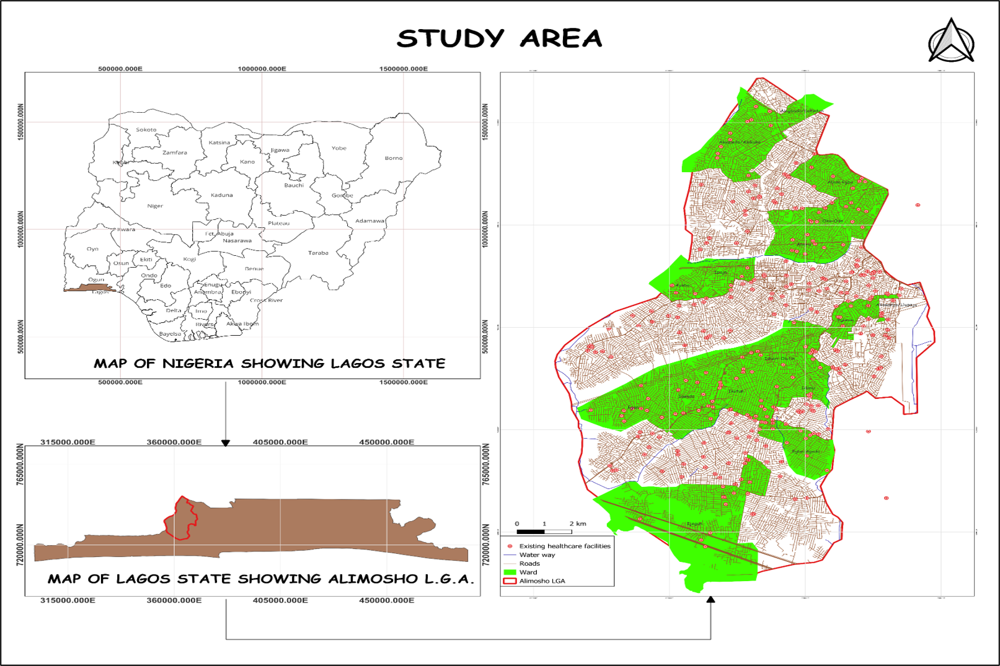
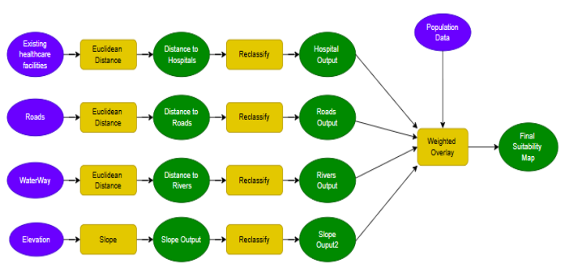
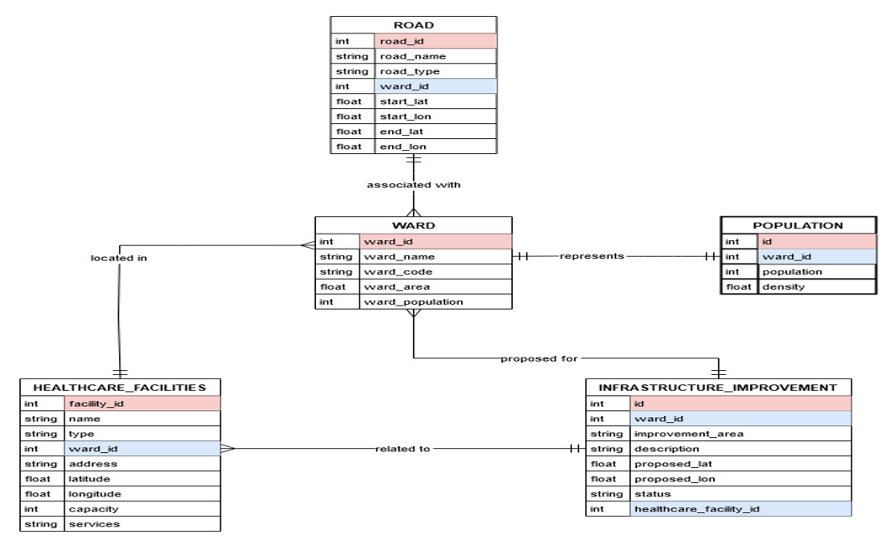

# healthcare-facility-mapping-alimosho-gis

## Introduction
This project applies Geographical Information System (GIS) technology to analyze and visualize the spatial distribution of healthcare facilities across Alimosho Local Government Area, Lagos State, Nigeria. 
**Tools & Technologies:** QGIS · SpatiaLite · OpenStreetMap · GRID3 · Analytical Hierarchy Process (AHP)

## Problem statement
1. How does the uneven distribution of healthcare facilities affect access to basic healthcare services in Alimosho LGA?

2. To what extent do some communities lack nearby health centers, and how does this impact emergency medical response?

3. How do long travel distances to healthcare facilities contribute to high maternal and infant mortality rates in Alimosho LGA?

4. What is the impact of inadequate numbers of doctors and nurses on healthcare delivery in the area?

5. How does overcrowding and insufficient medical supplies in existing healthcare centers affect service quality?

6. In what ways do poor road conditions limit accessibility to healthcare facilities in Alimosho LGA?

7. How is rapid population growth in Alimosho LGA increasing the demand for additional healthcare infrastructure and services?

8. How accessible are existing healthcare facilities to residents across different parts of Alimosho LGA?

9. How effective are the current healthcare facilities in meeting the needs of the population?

10. Where are the critical gaps in healthcare provision, and where should new facilities or improvements be prioritized?

## Data Sourcing
Data was normalised that is, the information was categorically seperated into differnt sheets or tables resulting into 5 tables:
- Ward
- Road
- Population
- HealthCare_Facilities
- Infrastructure_Improvement

Data was then locally extracted from Excel Workbook and GRID3 into QGIS for transformation, analysis and visualization.

## Modelling
Model built

Model builder                                                 |                  Entity Relationship Diagram
:------------------------------------------------------------:|:------------------------------------------------------------------------:
                                                |                 

