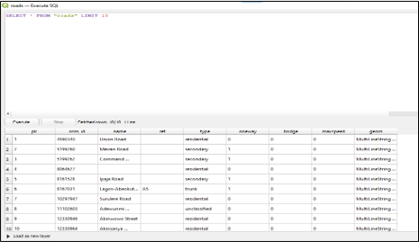

# healthcare-facility-mapping-alimosho-gis

## Introduction
This project applies Geographical Information System (GIS) technology to analyze and visualize the spatial distribution of healthcare facilities across Alimosho Local Government Area, Lagos State, Nigeria. 
**Tools & Technologies:** QGIS · SpatiaLite · OpenStreetMap · GRID3 · Analytical Hierarchy Process (AHP)

## Problem statement
1. How does the uneven distribution of healthcare facilities affect access to basic healthcare services in Alimosho LGA?

2. To what extent do some communities lack nearby health centers, and how does this impact emergency medical response?

3. How do long travel distances to healthcare facilities contribute to high maternal and infant mortality rates in Alimosho LGA?

4. What is the impact of inadequate numbers of doctors and nurses on healthcare delivery in the area?

5. How does overcrowding and insufficient medical supplies in existing healthcare centers affect service quality?

6. In what ways do poor road conditions limit accessibility to healthcare facilities in Alimosho LGA?

7. How is rapid population growth in Alimosho LGA increasing the demand for additional healthcare infrastructure and services?

8. How accessible are existing healthcare facilities to residents across different parts of Alimosho LGA?

9. How effective are the current healthcare facilities in meeting the needs of the population?

10. Where are the critical gaps in healthcare provision, and where should new facilities or improvements be prioritized?

## Data Sourcing
Data was normalised that is, the information was categorically seperated into differnt sheets or tables resulting into 5 tables:
- Ward
- Road
- Population
- HealthCare_Facilities
- Infrastructure_Improvement

Data was then locally extracted from Excel Workbook and GRID3 into QGIS for transformation, analysis and visualization.

## Data Model Design
The data required for this analysis are located in various spatial and attribute tables. Therefore, appropriate modelling is required. A relational database schema is designed using SpatiaLite in QGIS, with the Ward Table representing the central fact table containing all core ward data, and to which other dimension tables are modelled and connected using common key columns.

Model builder                                                 |                  Entity Relationship Diagram
:------------------------------------------------------------:|:--------------------------------------------------------------------:
                                                |                 

## Data Transformation
All datasets were coverted to a common projection system (UTM Zone 31N, WGS 84) and EPSG code and integrated into the QGIS software to develop a spatial database using the SpatialLite.

Existing Healthcare Table                                                       |                  Road Table
:------------------------------------------------------------------------------:|:--------------------------------------------------------------------:
                                         |                 

Model builder                                                 |                  Entity Relationship Diagram
:------------------------------------------------------------:|:--------------------------------------------------------------------:
                                                |                 
Model builder                                                 |                  Entity Relationship Diagram
:------------------------------------------------------------:|:--------------------------------------------------------------------:
                                                |                 

## Data Analysis/Visualization
Analysis was done using simple visuals since the tables have been perfectly modelled together.
- Buffer Analysis
- Rasterize and Polygonize (Vector2Raster conversion & vice versa)
- Proximity (Raster Distance) Analysis
- Suitability Analysis using Analytical Hierarchy Process
- Reclassification Analysis (Raster Calculator)
- Weighted overlay Analysis (Raster Calculator)

## Conclusions/Recommendations
- Alagbado/Kollinton ward requires urgent attention as it has zero healthcare facilities and should be prioritized for the construction of new health facilities.
- Ikotun ward has the highest concentration of healthcare facilities (24) and can serve as a model for healthcare planning in other wards.
- The government should invest in improving road networks to enhance accessibility to existing healthcare facilities, particularly in underserved communities.

My focus is to deliver actionable insights that can drive real decisions and improvements, and not just to build reports and maps.

Thank you. 😊

